# Vextis ERP

[](LICENSE)
[](services/enterprise-core)
[](services/agent-runtime)
[](apps/web)
[](infra)

> **All Things Agentic Hackathon** official submission under **The Fortified Enterprise Fleet** track.<br>
> Transforming unstructured business inputs into auditable, multi-agent operations across Sales, Inventory, and Finance.

---

## 🌐 Live Deployed Application

- **Hosted URL:** [https://vextis-erp.web.app](https://vextis-erp.web.app) (Deployed on Firebase Hosting)
- **Default Tenant:** `demo-tenant` (Pre-seeded with two synthetic customers, three inventory SKUs, and their credit profiles)
- **Judge Access:** Self-service registration is disabled for enterprise platform security. Dedicated evaluation credentials are provided privately in the *Testing Instructions / Access Instructions* field of the official Devpost submission.

> **Judges and evaluators:** Follow the complete [Reproducible Testing Guide](docs/TESTING.md) for access prerequisites, deterministic sample data, expected workflow states, Gemini Live validation, pass criteria, troubleshooting, and local test commands.
> The ready-to-upload [synthetic demo purchase order](docs/fixtures/vextis-demo-purchase-order.pdf) is included in the repository.

### Live Access & Evaluation Walkthrough
1. **Mission Control (`/app`):** Inspect the 4 registered specialist agents (`vextis_coordinator`, `vextis_crm_agent`, `vextis_inventory_agent`, `vextis_billing_agent`), their active models (`gemini-3.5-flash`), allowed tool scopes, and operational status.
2. **Order-to-Cash Pipeline (`/app/purchase-orders/new`):** Ingest purchase orders, follow autonomous multi-agent planning and stock reservations, review Human-in-the-Loop manager approval gates (`WAITING_APPROVAL`), and inspect generated invoices.
3. **Ask Vextis (Floating Assistant Widget):** Query grounded enterprise Q&A with similarity citations backed by PostgreSQL `pgvector`, and engage in real-time bidirectional voice interaction via Gemini Live Audio WebSockets directly to the Live gateway.

---

## 🌟 Hackathon Track & Architecture Overview

Vextis participates officially under **The Fortified Enterprise Fleet** track, incorporating autonomous task execution and collaborative assistance as supporting capabilities:

1. **The Fortified Enterprise Fleet (Official Entry Track):**
   - **Mission Control Registry:** Real-time visibility into registered specialist agents, model configurations (`gemini-3.5-flash`), prompt versions, and strict tool allowlists.
   - **Deterministic Tool Governance:** Every database mutation is executed exclusively by Java Enterprise Core. Tool invocations outside an agent's registered capability are blocked server-side and recorded as `DENIED`.
   - **Durable Audit Trail:** Structured PostgreSQL audit logging tracking actors (`AGENT` vs `USER`), correlation IDs, timestamps, and execution outcomes.

2. **Supporting Autonomous Workflows (Order-to-Cash):**
   - **Intake to Settlement:** Ingests unformatted purchase order PDFs, uses Gemini 3.5 Flash to extract SKU line items, coordinates inventory availability, reserves stock, evaluates credit terms, and issues invoices.
   - **Human-in-the-Loop (HITL) Checkpoints:** Automatically halts workflows requiring managerial sign-off before committing high-risk credit or financial decisions.

3. **Supporting Collaborative Assistant (Ask Vextis):**
   - **Gemini Live Audio Bridge:** Real-time, low-latency bidirectional voice interaction over WebSockets directly to `vextis-agent-runtime-live` using browser Web Audio API streaming.
   - **Grounded pgvector RAG:** Enterprise document Q&A backed by PostgreSQL vector search with similarity thresholds and source citations.
   - **On-Demand Proposal Visuals:** Capability-gated generation of proposal visual concepts via Imagen 3 on Vertex AI, registered with generation metadata and signed Cloud Storage URLs.

---

## 🏛 Architecture Diagram

```mermaid
flowchart TB
    User([Enterprise operator])

    subgraph Edge["User experience and identity"]
        Web["Angular web app<br/>Firebase Hosting"]
        Auth["Firebase Authentication"]
    end

    subgraph GCP["Google Cloud — us-central1"]
        subgraph Authority["Transactional authority — Cloud Run"]
            PublicCore["Enterprise Core — public<br/>Java · Spring Boot · GraphQL"]
            PrivateCore["Enterprise Core — private<br/>Authenticated agent tools"]
        end

        subgraph AgentPlane["Agent execution plane — Cloud Run"]
            Runtime["Agent Runtime<br/>Python · Google ADK"]
            Coordinator["Vextis Coordinator"]
            CRM["CRM & Sales Agent"]
            Inventory["Inventory Agent"]
            Finance["Finance & Billing Agent"]
            Live["Isolated Live Gateway<br/>WebSocket · read-only tools"]
        end

        subgraph AI["Vertex AI"]
            Gemini["Gemini 3.5 Flash<br/>planning · extraction · reasoning"]
            GeminiLive["Gemini Live<br/>bidirectional audio"]
            Embeddings["Vertex embeddings"]
            Imagen["Imagen 3<br/>optional proposal visuals"]
            Memory["Memory Bank<br/>optional · feature-flagged"]
        end

        subgraph Data["Managed data and messaging"]
            SQL[("Cloud SQL<br/>PostgreSQL 16 + pgvector")]
            PubSub["Pub/Sub<br/>order-events"]
            Storage[("Cloud Storage<br/>documents · invoices · assets")]
        end

        subgraph Controls["Security, delivery, and observability"]
            Secrets["Secret Manager"]
            IAM["IAM · service identities<br/>Workload Identity Federation"]
            Logs["Cloud Logging<br/>audit · correlation IDs"]
            Build["Cloud Build<br/>Artifact Registry"]
        end
    end

    User --> Web
    Web -->|"sign in"| Auth
    Web -->|"Firebase JWT · GraphQL"| PublicCore
    Web -->|"ephemeral session token · WSS"| Live

    PublicCore -->|"transactional outbox"| PubSub
    PubSub -->|"OIDC push · asynchronous work"| Runtime
    Runtime --> Coordinator
    Coordinator --> CRM
    Coordinator --> Inventory
    Coordinator --> Finance
    Runtime -->|"structured Gemini calls"| Gemini
    Runtime -->|"RAG queries"| Embeddings
    Runtime -.->|"safe preferences"| Memory
    CRM -.->|"on-demand visual"| Imagen

    Runtime -->|"authenticated, tenant-scoped tools"| PrivateCore
    Live -->|"validate session · read-only tools"| PrivateCore
    Live --> GeminiLive

    PublicCore --> SQL
    PrivateCore --> SQL
    PublicCore --> Storage
    PrivateCore --> Storage
    Runtime --> Storage

    Secrets -.-> PublicCore
    Secrets -.-> PrivateCore
    Secrets -.-> Runtime
    Secrets -.-> Live
    IAM -.-> PublicCore
    IAM -.-> PrivateCore
    IAM -.-> Runtime
    IAM -.-> Live
    PublicCore -.-> Logs
    PrivateCore -.-> Logs
    Runtime -.-> Logs
    Live -.-> Logs
    Build -.-> PublicCore
    Build -.-> PrivateCore
    Build -.-> Runtime
    Build -.-> Live

    classDef user fill:#17151f,color:#ffffff,stroke:#8b5cf6,stroke-width:2px;
    classDef core fill:#e8f0fe,color:#174ea6,stroke:#4285f4,stroke-width:2px;
    classDef agent fill:#f3e8ff,color:#5b21b6,stroke:#8b5cf6,stroke-width:2px;
    classDef ai fill:#fce8e6,color:#a50e0e,stroke:#ea4335,stroke-width:2px;
    classDef data fill:#e6f4ea,color:#137333,stroke:#34a853,stroke-width:2px;
    classDef control fill:#fef7e0,color:#7a4f01,stroke:#fbbc04,stroke-width:2px;

    class User,Web,Auth user;
    class PublicCore,PrivateCore core;
    class Runtime,Coordinator,CRM,Inventory,Finance,Live agent;
    class Gemini,GeminiLive,Embeddings,Imagen,Memory ai;
    class SQL,PubSub,Storage data;
    class Secrets,IAM,Logs,Build control;
```



- **Java** is the sole authority for CRM, inventory, and billing mutations.
- **Python** coordinates agents, RAG, and workflows, but does not write directly to business tables.
- **GraphQL SDL, OpenAPI, AsyncAPI, and JSON Schema** serve as strict contracts between Angular, Java, and Python.
- **PostgreSQL + pgvector** stores transactional data, durable state, audit logs, outbox events, and RAG embeddings.
- **Cloud Storage** stores uploaded documents and generated proposal assets.

---

## 📁 Monorepo Structure

```text
apps/web/                         Angular 22.1.x web client (Material 3, Apollo GraphQL, Signals, Web Audio)
services/enterprise-core/         Java 21 + Spring Boot 4.1.0 transactional backend
services/agent-runtime/           Python 3.13 + Google ADK agent runtime and Live gateway
contracts/                        GraphQL SDL, internal OpenAPI 3.0, AsyncAPI, and JSON Schemas
infra/                            Terraform IAC, deployment configs, and deterministic seed scripts
docs/                             Architecture decisions (ADR), runbooks, demo script, and pitch deck
```

---

## 🚀 Local Quickstart

### Prerequisites
- **Java 17+ or 21** (The Gradle wrapper automatically configures the required Java 21 toolchain)
- **Node.js 22+** and **pnpm 10+**
- **Python 3.13** and **uv**
- **Docker Desktop**

### Setup & Run
```powershell
# 1. Clone & prepare environment
Copy-Item .env.example .env

# 2. Launch local infrastructure & services
./tools/dev.ps1 infra     # Local PostgreSQL + pgvector container + Pub/Sub emulator in Docker
./tools/dev.ps1 core      # Enterprise Core (Java 21 / Spring Boot on :8080)
./tools/dev.ps1 agents    # Agent Runtime (Python 3.13 / Google ADK on :8081)
./tools/dev.ps1 web       # Angular Web UI (on :4200)

# 3. Seed demo data (optional)
./tools/seed-demo.ps1     # Seeds customers, inventory, and credit profiles for demo-tenant
```

- **Angular Web UI:** `http://localhost:4200`
- **Public GraphQL Endpoint:** `http://localhost:8080/graphql`
- **Agent Runtime Health:** `http://localhost:8081/health`
- **Full Verification Suite:** `./tools/check.ps1`

---

## 🧪 Comprehensive Verification Suites

For the complete hosted and local evaluation procedure, see [`docs/TESTING.md`](docs/TESTING.md).

| Component | Test Suite | Validation Status |
|---|---|---|
| **Enterprise Core** | `./gradlew test` | Unit, controller, and integration tests passing cleanly |
| **Agent Runtime** | `uv run pytest`, `uv run ruff check`, `uv run mypy` | Unit and contract tests passing (excludes `model_eval` by default); lint and typecheck clean |
| **Angular Web UI** | `pnpm web:test`, `pnpm web:lint`, `pnpm web:build` | Unit tests passing, ESLint clean, production build passing |

> Note: `uv run pytest` runs fast unit and contract tests by default. Tests marked `@pytest.mark.model_eval` require live Vertex AI credentials and are invoked explicitly with `uv run pytest -m model_eval`.

---

## 📚 Deliverables & Documentation

- **Demo Video:** `[Demo Video Placeholder - Recording in progress]`
- **Reproducible Testing Guide:** [`docs/TESTING.md`](docs/TESTING.md)
- **Demo Screenplay & Script:** [`docs/DEMO_SCRIPT.md`](docs/DEMO_SCRIPT.md)
- **Pitch Deck & Architecture Story:** [`docs/PITCH_DECK.md`](docs/PITCH_DECK.md)
- **Devpost Submission Narrative:** [`docs/SUBMISSION.md`](docs/SUBMISSION.md)
- **Contracts Specification:** [`docs/CONTRACTS.md`](docs/CONTRACTS.md)
- **Tech Stack Specification:** [`docs/TECH_STACK.md`](docs/TECH_STACK.md)

---

## 📄 License & Attributions

Copyright © 2026 Rafael Patiño Díaz.
Distributed under the [Apache License 2.0](LICENSE). See also [NOTICE](NOTICE).
