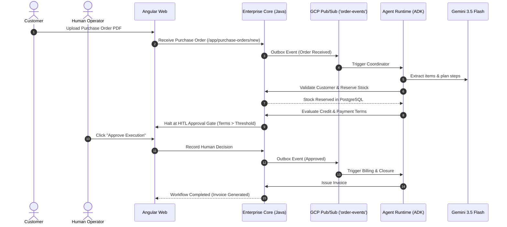

# Vextis ERP — Pitch Deck & Architecture Story

> **Track:** The Fortified Enterprise Fleet
> **Competition:** Google Cloud All Things Agentic Hackathon
> **Author & Architect:** Rafael Patiño Díaz
> **Deployed Application:** [https://vextis-erp.web.app](https://vextis-erp.web.app) (Firebase Hosting)
> **Official Demo Video:** [Watch Vextis ERP on YouTube](https://youtu.be/ZDlBD1Vbta0)

---

## Slide 1: Title & Vision

### Vextis ERP: The Governed Multi-Agent Operating System
*Transforming unstructured business documents and voice interactions into auditable, multi-agent operations across Sales, Inventory, and Finance.*

- **Category:** The Fortified Enterprise Fleet
- **Core Technologies:** Gemini 3.5 Flash, Google Agent Development Kit (ADK), Vertex AI (Imagen 3, Live Audio), Java 21 Spring Boot 4.1.0, Angular 22.1.x, Google Cloud Platform (Cloud Run, Cloud SQL, Pub/Sub, Firebase Hosting).

---

## Slide 2: The Enterprise Challenge

### The Problem: Fragmented Operations & Unbounded Autonomous Agents

1. **Unstructured Document Friction:** Companies spend significant manual effort interpreting customer purchase orders, price requests, and emails across disparate spreadsheets.
2. **Siloed Departmental Hand-offs:** Sales promises delivery dates without real-time inventory reservation; billing generates invoices with unapproved payment terms.
3. **The "Rogue Agent" Dilemma:** Standard LLM agent wrappers lack transactional boundaries. Giving LLMs direct database write access creates risks of data race conditions, unapproved discounts, and untraceable schema corruption.

---

## Slide 3: The Vextis Solution

### Dual-Runtime Architecture: Intelligence Governed by Transactional Truth

```text
+-------------------------------------------------------------------------+
|                   FIREBASE HOSTING: ANGULAR WEB APP                     |
|                        https://vextis-erp.web.app                       |
|           Mission Control (/app) · New Order · Ask Vextis Widget        |
+-------------------+---------------------------------+-------------------+
                    | GraphQL (HTTP/HTTPS)            | WebSockets (/ws/live)
                    v                                 v
+-------------------+--------------------+  +---------+-------------------+
|      CLOUD RUN: ENTERPRISE CORE        |  |    CLOUD RUN: LIVE GATEWAY  |
|      (Java 21 / Spring Boot 4.1.0)     |  |       (Python 3.13 / ADK)   |
|  - Sole authority for mutations        |  |  - Bidirectional Web Audio  |
|  - Multi-tenant data isolation         |  |  - WebSocket Session Client |
|  - Role-based tool allowlists          |  +---------+-------------------+
|  - Structured PostgreSQL audit log     |            |
+-------------------+--------------------+            |
                    | Outbox Events                   |
                    v (Pub/Sub 'order-events')        |
+-------------------+--------------------+            |
|       CLOUD RUN: AGENT RUNTIME         |            |
|          (Python 3.13 / ADK)           |            |
|  - Specialist Fleet Coordination       |            |
|  - Gemini 3.5 Flash Reasoning          |            |
|  - Grounded pgvector RAG               |            |
+-------------------+--------------------+            |
                    | Tool Calls (REST)               |
                    v                                 v
+-------------------+--------------------+  +---------+-------------------+
|      MANAGED GOOGLE CLOUD DATA         |  |       VERTEX AI & STORAGE   |
|   - Cloud SQL (PostgreSQL 16)          |  |   - Gemini 3.5 Flash / Live |
|   - pgvector (Embeddings & RAG)        |  |   - Imagen 3 (Concepts)     |
|   - Cloud Pub/Sub ('order-events')     |  |   - Cloud Storage (GCS)     |
+----------------------------------------+  +-----------------------------+
```

- **Enterprise Core (Java 21):** Enforces ACID transactions, role-based tool allowlists, and append-only audit logs via GraphQL APIs.
- **Agent Runtime & Live Gateway (Python 3.13 / Google ADK):** Orchestrates intelligent reasoning, planning, pgvector RAG, and Web Audio streaming without direct database access.

---

## Slide 4: The Governed Specialist Fleet

### Three Real Business Domains — Clean Service Boundaries

| Specialist Agent | Core Responsibility | Governed Tool Permissions |
|---|---|---|
| **Vextis Coordinator** | Workflow decomposition & plan recording | `record_execution_plan`, `request_workflow_approval` |
| **CRM & Sales Agent** | Customer context, pricing rules, proposal visuals | `lookup_customer`, `register_quote_asset` |
| **Inventory Agent** | SKU catalog translation, availability & reservation | `get_stock`, `reserve_stock` |
| **Billing Agent** | Credit standing, terms validation, invoice creation | `get_credit`, `create_invoice` |

- **Security Rule:** If an agent attempts to execute an action outside its registered capability (e.g. CRM agent trying to issue an invoice), the call is blocked server-side by Enterprise Core and recorded with status `DENIED`.

---

## Slide 5: Autonomous Task Execution & Human-in-the-Loop

### End-to-End Order-to-Cash Execution



---

## Slide 6: Deep Google Cloud & Vertex AI Integration

### Native Cloud Infrastructure & Multimodal Innovation

1. **Gemini 3.5 Flash:** Fast, structured reasoning for planning, document extraction, and tool orchestration.
2. **Google Agent Development Kit (ADK):** Multi-agent lifecycle and workflow coordinator.
3. **Cloud SQL PostgreSQL 16 + pgvector:** Native vector embeddings with tenant-scoped cosine similarity queries.
4. **Gemini Live Audio Bridge:** Real-time bidirectional voice interface using browser Web Audio PCM streaming to `vextis-agent-runtime-live`.
5. **Imagen 3 (`imagen-3.0-generate-002`):** Capability-gated proposal concept visualization with prompt sanitization and generation-pinned signed URLs.
6. **Firebase Hosting & Cloud Run:** Serverless, modular deployment with least-privilege keyless service identities.

---

## Slide 7: Fortified Governance & Auditability

### Enterprise Governance Foundations

- **Zero Direct Database Access for AI:** All database writes must pass through Enterprise Core internal tool controllers.
- **Tenant Isolation:** Enforced at database schema level and HTTP header verification (`X-Tenant-Id`).
- **Prompt Sanitization:** Automated scrubbing of bearer tokens, card numbers, emails, and passwords before AI invocation.
- **Structured Audit Logging:** Every tool invocation, actor type (`AGENT` vs `USER`), correlation ID, and execution status (`SUCCEEDED` / `DENIED`) is durably stored in PostgreSQL.

---

## Slide 8: Measurable Operational Improvements

### Traditional ERP vs. Governed Multi-Agent Execution

| Dimension | Traditional Manual ERP | Vextis Governed Fleet |
|---|---|---|
| **Order Intake & Extraction** | Manual data entry (45–90 min/order) | Automated Gemini extraction (< 30 sec) |
| **Inventory Reservations** | Batch or delayed reconciliation | Real-time ACID reservations in PostgreSQL |
| **Tool Execution Safety** | Unrestricted access or rigid hardcoding | Server-side role-based tool allowlists |
| **Audit Traceability** | Fragmented system logs | Unified correlation-tracked audit logs |

---

## Slide 9: Summary & Next Horizons

### The Future of Agentic Enterprise Software

- **Current Foundation:** Modular vertical slice across CRM, Inventory, Billing with Gemini Live audio and Imagen 3 proposal concepts.
- **Next Phase:**
  - Automated B2B EDI ingestion connectors (XML / EDIFACT).
  - Predictive supply chain replenishment workflows.
  - Multi-region high-availability deployment.

**Explore the application live at [https://vextis-erp.web.app](https://vextis-erp.web.app).**
