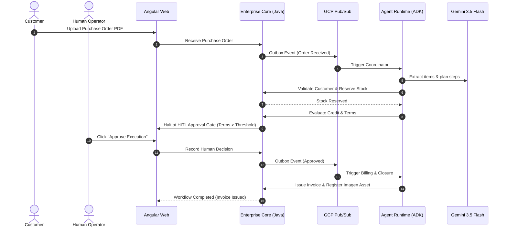

# Vextis ERP — Pitch Deck & Architecture Story

> **Track:** The Fortified Enterprise Fleet  
> **Google All Things Agentic Hackathon**  
> **Author & Architect:** Rafael Patiño Díaz  

---

## Slide 1: Title & Vision

### Vextis ERP: The Governed Agent Fleet for Enterprise Operations
*Transforming unstructured business inputs into auditable, multi-agent operations across Sales, Inventory, and Finance.*

- **Category:** The Fortified Enterprise Fleet
- **Core Technologies:** Gemini 3.5 Flash, Google Agent Development Kit (ADK), Vertex AI (Memory Bank, Imagen 3, Live Audio), Java 21 Spring Boot, Angular, Google Cloud Platform (Cloud Run, Cloud SQL, Pub/Sub).

---

## Slide 2: The Enterprise Challenge

### The Problem: Chaos in Mid-Market ERP & Dangerous Autonomous Agents

1. **Unstructured Document Friction:** Every day, mid-market companies process hundreds of purchase orders, quotes, and emails manually.
2. **Siloed Departmental Data:** Sales promises delivery dates without checking stock; billing generates invoices with unapproved payment terms.
3. **The "Rogue AI" Dilemma:** Standard LLM wrappers and chatbots lack transactional boundaries. Giving LLMs direct database write access creates catastrophic financial and legal risk.

---

## Slide 3: The Vextis Solution

### Dual-Authority Architecture: Intelligence Governed by Transactional Truth

```text
+-------------------------------------------------------------------------+
|                              ANGULAR WEB                                |
|             Mission Control · Purchase Orders · Ask Vextis              |
+------------------------------------+------------------------------------+
                                     | GraphQL / WebSockets
                                     v
+------------------------------------+------------------------------------+
|            TRANSACTIONAL AUTHORITY (Java 21 / Spring Boot)              |
|   - Sole authority for mutations   - Cryptographic tool policies        |
|   - Multi-tenant data isolation    - Durable PostgreSQL audit trail     |
+------------------+---------------------------------+--------------------+
                   | Outbox Events                   ^ Tool Invocations
                   v (Pub/Sub)                       | (REST + HMAC/Token)
+------------------+---------------------------------+--------------------+
|               AGENTIC INTELLIGENCE (Python 3.13 / Google ADK)           |
|   - Specialist Fleet Coordination  - Gemini 3.5 Flash Planner           |
|   - Grounded pgvector RAG          - Vertex AI Memory Bank              |
|   - Gemini Live Audio WebSocket    - Imagen 3 Visual Asset Generator    |
+-------------------------------------------------------------------------+
```

- **Enterprise Core (Java):** Enforces ACID transactions, role-based tool allowlists, and immutable audit logs.
- **Agent Runtime (Python / Google ADK):** Orchestrates intelligent reasoning, planning, RAG, and multimodal bonuses without direct database access.

---

## Slide 4: The Governed Specialist Fleet

### Three Real Business Domains — Zero Hallucinated Bloat

| Specialist Agent | Core Responsibility | Governed Tool Permissions |
|---|---|---|
| **Vextis Coordinator** | Workflow decomposition & plan recording | `record_execution_plan`, `request_approval` |
| **CRM & Sales Agent** | Customer context, pricing rules, proposal visuals | `get_customer_context`, `register_quote_asset` |
| **Inventory Agent** | SKU catalog translation, availability & reservation | `check_inventory`, `reserve_inventory` |
| **Billing Agent** | Credit standing, terms validation, fiscal invoicing | `check_credit_standing`, `issue_invoice` |

- **Security Rule:** If an agent attempts to execute an action outside its registered capability (e.g. CRM agent trying to issue an invoice), the call is instantly rejected and recorded as `DENIED`.

---

## Slide 5: Autonomous Taskmaster & Human-in-the-Loop

### End-to-End Order-to-Cash Execution



---

## Slide 6: Deep Google Cloud & Vertex AI Integration

### Native Cloud Infrastructure & Multimodal Innovation

1. **Gemini 3.5 Flash:** Fast, cost-efficient, grounded reasoning for planning and document analysis.
2. **Google Agent Development Kit (ADK):** Industrial-grade multi-agent lifecycle and execution engine.
3. **Vertex AI Memory Bank:** Persistent cross-conversation memory bounded by tenant identity.
4. **Cloud SQL PostgreSQL + pgvector:** Native vector embeddings with strict tenant metadata filtering.
5. **Gemini Live Audio:** Real-time bidirectional voice bridge using Web Audio streaming.
6. **Imagen 3 (`imagen-3.0-generate-002`):** Automated proposal concept visualization with prompt redaction.
7. **Cloud Run & Pub/Sub:** Serverless, autoscaling, enterprise deployment.

---

## Slide 7: Fortified Security & Auditability

### Uncompromising Enterprise Governance

- **Zero Direct DB Access for Agents:** All database writes must pass through Enterprise Core internal tool controllers.
- **Tenant Isolation:** Enforced at database schema level and HTTP header verification (`X-Tenant-Id`).
- **Prompt Sanitization:** Automated scrubbing of bearer tokens, credit cards, emails, and passwords before AI invocation.
- **Immutable Audit Trail:** Every tool invocation, actor type (`AGENT` vs `USER`), correlation ID, and outcome (`SUCCEEDED` / `DENIED`) is durably stored in PostgreSQL.

---

## Slide 8: Measurable Business Impact & ROI

### Real-World Mid-Market Metrics

| Metric | Traditional ERP Process | Vextis Governed Fleet |
|---|---|---|
| **Order Processing Time** | 45–90 minutes per order | **< 30 seconds** (autonomous) |
| **Inventory Discrepancy** | High (delayed reservations) | **0%** (immediate transactional reservation) |
| **Rogue Agent Risk** | High in unconstrained LLMs | **0%** (deterministic tool allowlists) |
| **Audit Compliance** | Manual logging & fragmented logs | **100% durable traceability** |

---

## Slide 9: Summary & Next Horizons

### The Future of Agentic Enterprise Software

- **Today:** Production-ready vertical slice across CRM, Inventory, Billing with Gemini Live and Imagen 3.
- **Next Phase:**
  - Automated B2B EDI ingestion connectors.
  - Predictive supply chain replenishment agents.
  - Multi-region disaster recovery deployment.

**Experience the future of enterprise operations at Vextis ERP.**
